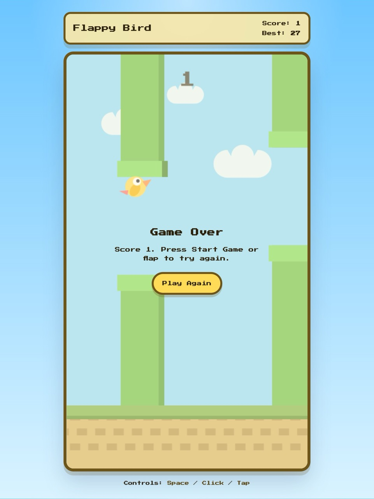
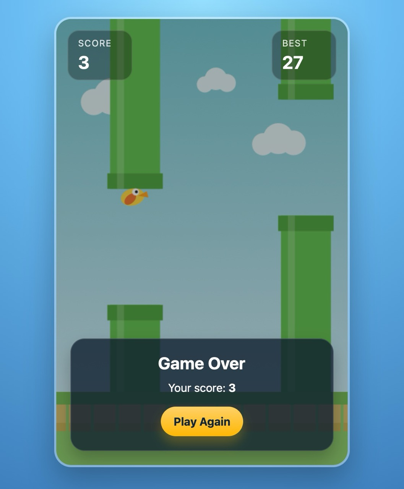
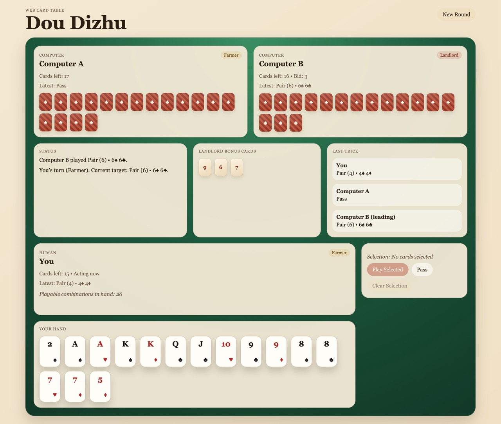
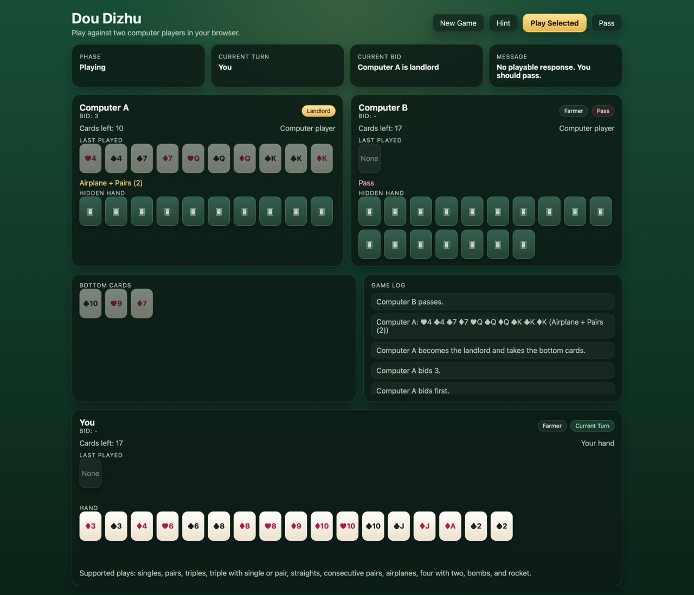
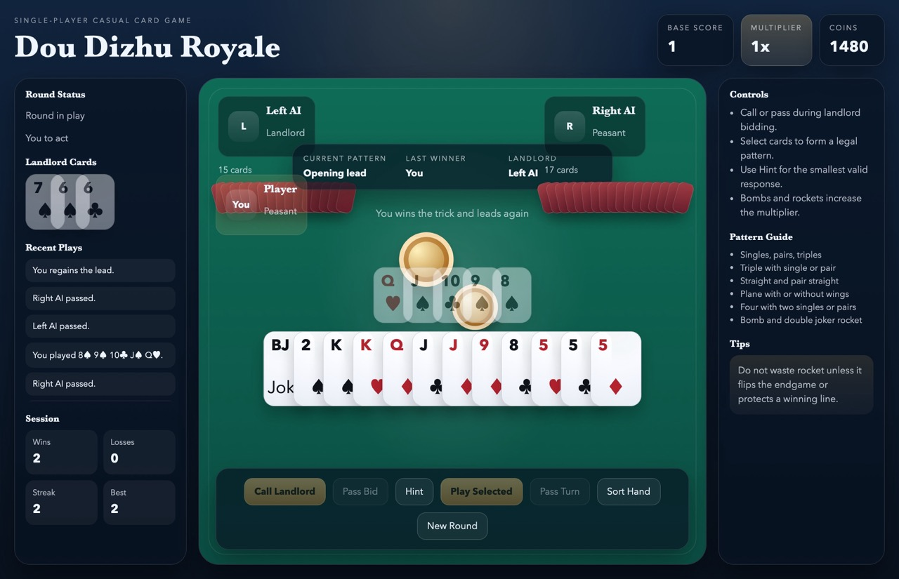
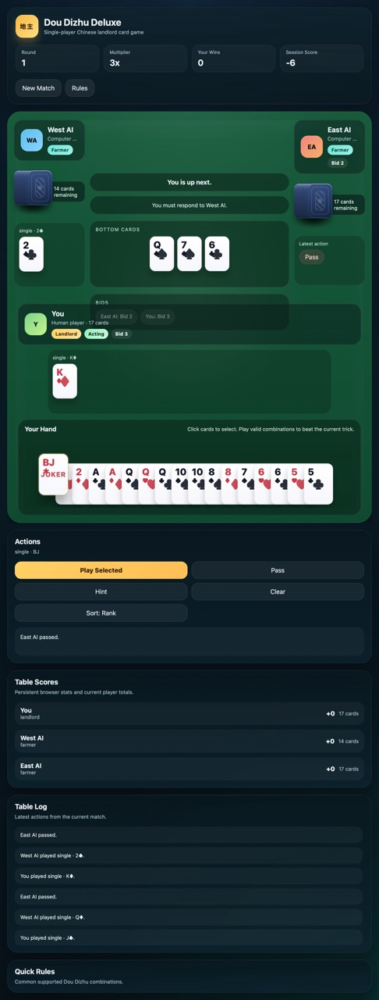

# mini-codex-examples

Here are some examples created by [mini-codex](https://github.com/Carlos-Mel/mini-codex) and original [OpenAI Codex](https://github.com/openai/codex). mini-codex is a toy clone of the famous coding agent Codex, which re-implements its core logic in minimal code length. These small projects indicates that mini-codex already exhibits competitive performance on small projects with the help of strong backend models, while Codex would still far better on long-term tasks, security and user experiences.

## Screenshots

These are screenshots of the small projects in this repo, which are created either by mini-codex or Codex.

**Flappy Bird**: created by OpenAI Codex CLI v0.111.0 with GPT-5.4 and prompt: "Please help me build a classic flappy bird web game from scratch."

**Flappy Bird**: created by mini-codex v0.1.0 with GPT-5.4 and prompt: "Please help me build a classic flappy bird web game from scratch."

**Dou Dizhu**: created by OpenAI Codex CLI v0.111.0 with GPT-5.4 and prompt: "Please build a web version of the card game Dou Dizhu where I can play with two computer player."

**Dou Dizhu**: created by mini-codex v0.1.0 with GPT-5.4 and prompt: "Please build a web version of the card game Dou Dizhu where I can play with two computer player."

**Dou Dizhu Plus**: created by OpenAI Codex CLI v0.111.0 with GPT-5.4 and prompt: "Please build a high-quality, polished, single-player web version of the Chinese card game Dou Dizhu from scratch. This is not a toy demo. I want a visually refined, feature-rich, production-style browser game that feels close to a real commercial casual card game, while still being fully playable as a standalone front-end project."

**Dou Dizhu Plus**: created by mini-codex v0.1.0 with GPT-5.4 and prompt: "Please build a high-quality, polished, single-player web version of the Chinese card game Dou Dizhu from scratch. This is not a toy demo. I want a visually refined, feature-rich, production-style browser game that feels close to a real commercial casual card game, while still being fully playable as a standalone front-end project."

